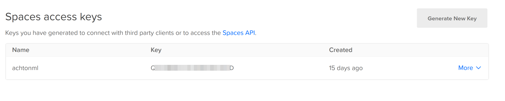
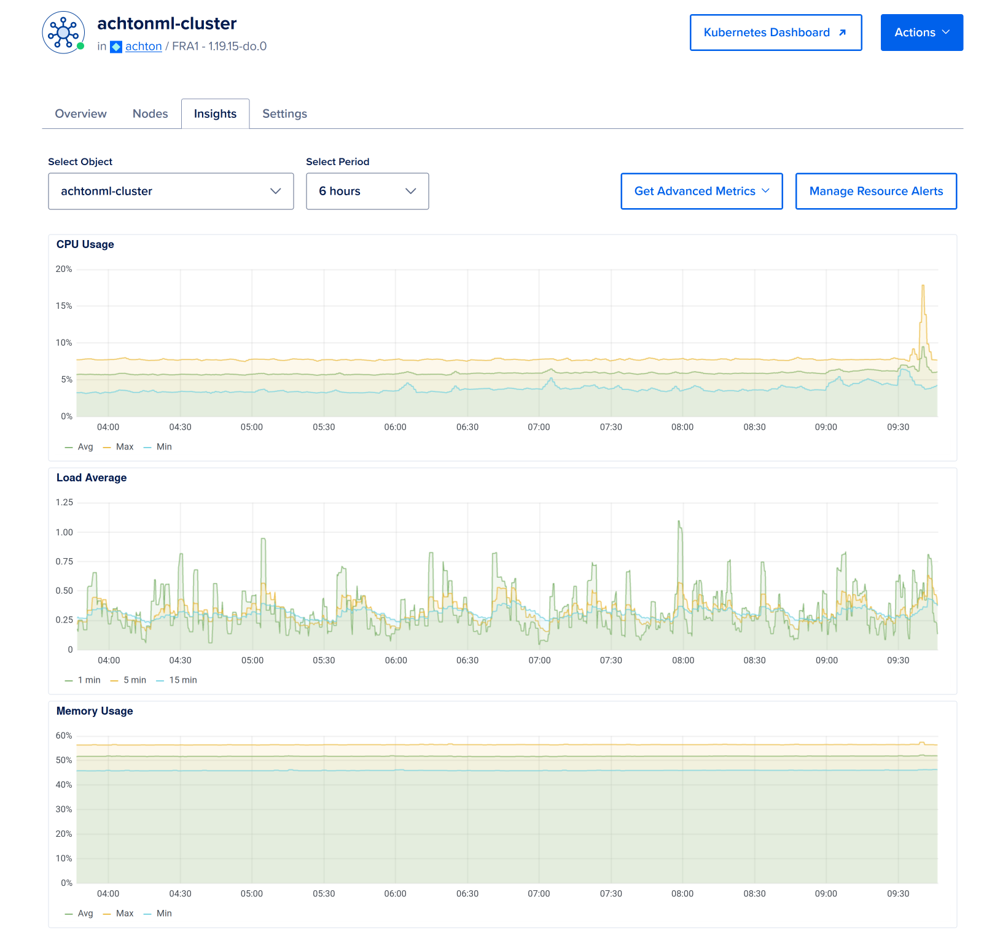
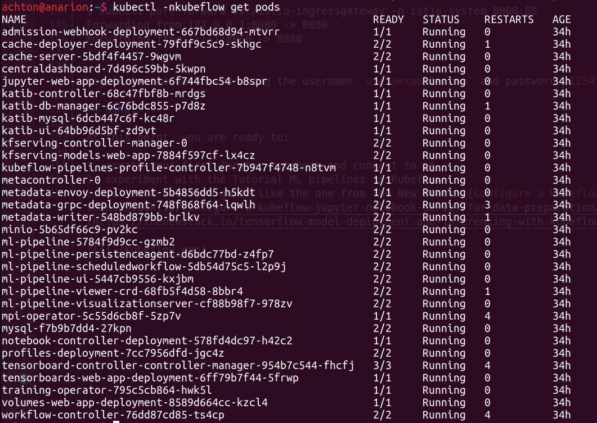
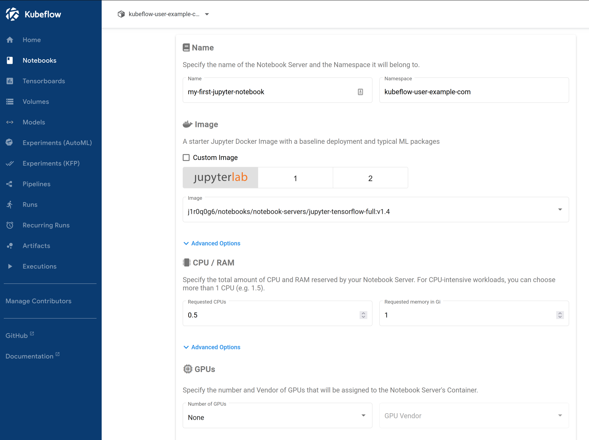

# Repo for the DigitalOcean Kubernetes Challenge 2021

Author: [Achton Smidt Winther](https://github.com/achton)

## Goal

I chose the following goal: **Deploy a machine learning management platform**

The challenge describes this as:
> "Machine learning requires complex workflows, and can benefit from an AI/ML
> management platform. Kubeflow offers a wide range of features in this area,
> including creation of Notebooks, Pipelines, Model training, Model Serving, and
> more."

My personal aim is to:

1. provision a K8s cluster on DO with Terraform
1. successfully deploy the Kubeflow components
1. access the Kubeflow dashboard
1. setup a simple Jupyter notebook server
1. document it!

## Prepare environment and tools

Before we begin, some preparations are necessary.

We need `terraform` and `kubectl` installed.

```sh
$ kubectl version --client --short
Client Version: v1.23.1
```

We also need to create a work folder for our stuff called **kubeflow**:

```sh
mkdir kubeflow
cd kubeflow
```

### Setup a DO Space

We will use DigitalOcean Spaces for Terraform state management.

Create a set of **Spaces access keys** at
https://cloud.digitalocean.com/account/api/tokens. Take note of the access token
(short) and the secret key (longer string).



### Create access token for the DO API

Also create a **Personal access token** at
https://cloud.digitalocean.com/account/api/tokens.

### Fetch the Terraform config files

Clone this repo to get the TF files which define the DO cluster.

```sh
git clone https://github.com/achton/do-k8s-challenge.git
```

### Fetch the Kubeflow manifests

We install Kubeflow using the [official Manifests Working Group
repo](https://github.com/kubeflow/manifests), which we use to install all
Kubeflow components. The latest release is `v1.4.0` so we check that release out
to a folder called `kf-manifests/`:

```sh
git clone -b v1.4.0 https://github.com/kubeflow/manifests.git kf-manifests/
```

### Kustomize

The prerequisites mention that the manifests are tested with `kustomize` version
3.2.0, so we download that specific version for our use:

```sh
wget -O ./kustomize https://github.com/kubernetes-sigs/kustomize/releases/download/v3.2.0/kustomize_3.2.0_linux_amd64

chmod +x kustomize
```

Check the version:

```sh
./kustomize version --short
3.2.0
```

## Provision your DigitalOcean Kubernetes cluster

The prerequisites also mention that the manifests are tested with Kubernetes
version 1.19, so my Terraform files are based on that.

Copy the `terraform/terraform.tfvars-example` to `terraform/terraform.tfvars`:

```sh
cd do-k8s-challenge/
cp `terraform/terraform.tfvars-example` `terraform/terraform.tfvars`
```

Now edit the file and your Personal Access Token from previously. You should
leave the K8s version as-is.

To initialize your Terraform project, provide the DO Spaces keys in the command
line like in this example:

```sh
cd terraform/
SPACES_ACCESS_TOKEN=DQ6XMAS2021UTB4NVHNO \
  && SPACES_SECRET_KEY=o4oCjGyfesStX0wBMpBXMaS2021sykuHKqaf62BlLe \
  && terraform init \
    -backend-config="secret_key=$SPACES_SECRET_KEY" \
    -backend-config="access_key=$SPACES_ACCESS_TOKEN"
```

Then plan and apply to create your cluster:

```sh
terraform plan && terraform apply
```



## Install Kubeflow

The Kubeflow manifests repo README [gives us this
one-liner](https://github.com/kubeflow/manifests#install-with-a-single-command)
for installing the Kubeflow components:

```sh
cd kf-manifests
while ! ./kustomize build example | kubectl apply -f -; do echo "Retrying to apply resources"; sleep 10; done
```

This will take a good while during which some containers will be crashing or
unable to start. But eventually, everything will be running perfectly!



## Access Kubeflow dashboard

The easiest way to gain access to the cluster and the KF dashboard is by
forwarding traffic from your machine to the Ingress controller:

```sh
$ kubectl port-forward svc/istio-ingressgateway -n istio-system 8080:80
Forwarding from 127.0.0.1:8080 -> 8080
Forwarding from [::1]:8080 -> 8080
```

You can then access the dashboard at http://localhost:8080

Log in to the dashboard using the username `user@example.com` and password `12341234`.

## DONE!

At this point, you are ready to:

1. create your first Jupyter notebook and connect to it
1. experiment with the Tutorial ML pipelines in Kubeflow
1. follow a Kubeflow guide like the one from The New Stack: [Configure a Kubeflow Jupyter Notebook Server for Data Preparation](https://thenewstack.io/configure-a-kubeflow-jupyter-notebook-server-for-data-preparation/) and [Tensorflow Model Deployment and Inferencing with Kubeflow](https://thenewstack.io/tensorflow-model-deployment-and-inferencing-with-kubeflow/).

